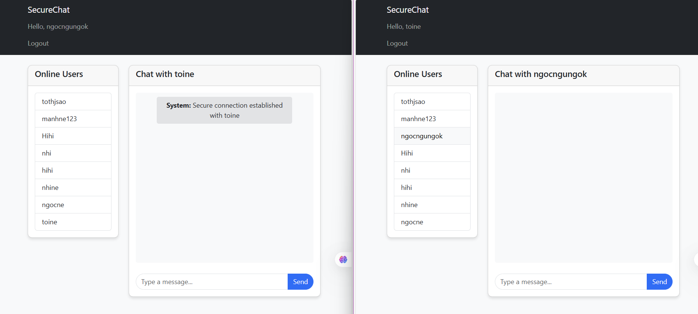

                                                      ỨNG DỤNG BẢO MẬT TIN NHẮN VĂN BẢN VỚI MÃ HÓA AES VÀ XÁC THỰC RSA
Tổng quan
SecureChat là một ứng dụng chat web bảo mật cao, sử dụng kết hợp mã hóa đối xứng AES và mã hóa bất đối xứng RSA để đảm bảo tính bảo mật, toàn vẹn và xác thực của tin nhắn. Ứng dụng được phát triển bằng Flask và Socket.IO, cung cấp giao tiếp thời gian thực với mức độ bảo mật cao.
Đặc điểm chính

Bảo mật mạnh mẽ
Mã hóa AES-256-CBC: Mã hóa nội dung tin nhắn với thuật toán AES 256-bit
Xác thực RSA-2048: Sử dụng chữ ký số RSA để xác thực người gửi
Trao đổi khóa an toàn: Khóa AES được mã hóa bằng khóa công khai RSA
Băm SHA-256: Đảm bảo tính toàn vẹn dữ liệu

Giao tiếp thời gian thực
WebSocket: Sử dụng Socket.IO cho giao tiếp tức thời
Xác nhận tin nhắn: Hệ thống ACK/NACK để xác nhận gửi/nhận
Thông báo trạng thái: Hiển thị trạng thái tin nhắn (đã gửi, đã nhận, lỗi)

Quản lý người dùng
Đăng ký/Đăng nhập: Hệ thống xác thực người dùng
Tạo khóa tự động: Sinh cặp khóa RSA cho mỗi người dùng
Lưu trữ phiên: Quản lý phiên chat và khóa mã hóa

Kiến trúc bảo mật
1. Quy trình đăng ký người dùng
Người dùng đăng ký → Sinh cặp khóa RSA (2048-bit) → Băm mật khẩu (SHA-256) → Lưu trữ thông tin
2. Quy trình trao đổi khóa
A muốn chat với B → Sinh khóa AES ngẫu nhiên → Mã hóa khóa AES bằng Public Key của B → 
Ký metadata bằng Private Key của A → Gửi gói trao đổi khóa cho B
3. Quy trình gửi tin nhắn
Mã hóa tin nhắn bằng AES-CBC → Tính hash SHA-256 → Ký hash bằng RSA → 
Gửi gói tin (IV + Cipher + Hash + Signature)
4. Quy trình xác thực tin nhắn
Nhận gói tin → Xác thực chữ ký RSA → Giải mã tin nhắn AES → Kiểm tra hash → 
Gửi ACK/NACK

Cấu trúc dự án
secure-chat/
├── app.py                 # Ứng dụng Flask chính
├── templates/
│   ├── base.html         # Template cơ sở
│   ├── index.html        # Giao diện chat chính
│   ├── login.html        # Trang đăng nhập
│   └── register.html     # Trang đăng ký
├── static/
│   ├── css/
│   │   └── style.css     # Stylesheet
│   └── js/
│       └── chat.js       # JavaScript chat logic
├── sessions/             # Thư mục lưu phiên chat

Cài đặt và sử dụng
Yêu cầu hệ thống
Python 3.7+
pip (Python package manager)

Các thư viện cần thiết
pip install flask flask-socketio pycryptodome
Chạy ứng dụng
bashpython app.py

Thuật toán mã hóa

AES-256-CBC: Mã hóa đối xứng cho nội dung tin nhắn
RSA-2048: Mã hóa bất đối xứng cho trao đổi khóa và chữ ký số
SHA-256: Hàm băm để đảm bảo tính toàn vẹn
PKCS1_v1_5: Padding scheme cho RSA
PKCS#7: Padding cho AES

Cơ sở dữ liệu
users.json: Lưu trữ thông tin người dùng (username, password hash, public/private keys)
sessions/*.json: Lưu trữ thông tin phiên chat (AES keys, metadata)

Tính năng bảo mật

Đã triển khai
Mã hóa end-to-end với A203955.png" alt="Đăng ký đăng nhập" width="200"/>
    

        
    

